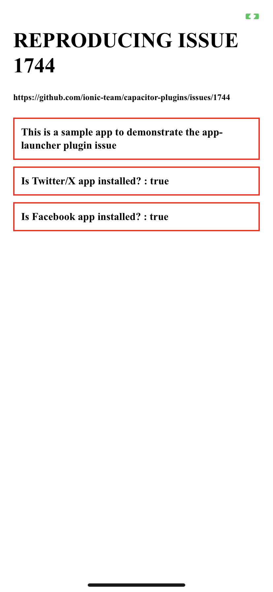
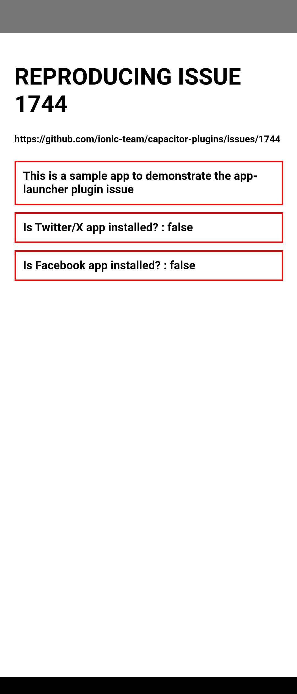

## Sample iOS & Android app to demonstrate an issue with the capacitor/app-launcer plugin on Android


See the issue here : [https://github.com/ionic-team/capacitor-plugins/issues/1744](https://github.com/ionic-team/capacitor-plugins/issues/1744)


-----------------

#### sample app id

`com.kosso.applauncherissue`

- To test this app, please ensure you have both the Twitter/X & Facebook apps installed on iOS and Android test devices. 

This sample app will use the documented `AppLauncher.canOpenUrl()` method to test to see if the Twitter/X and Facebook apps are installed on iOS and Android.  The results are shown in the app window.


To do this, we test for the URLs : `twitter://timeline`  and `fb://feed`.


#### Results (with both Twitter and Facebook apps installed on the devices)
---------------------
#### Result iOS


---------------------

#### Result Android


---------------------

## Bug Report 

### Plugin(s)

`app-launcher`


### Capacitor Version

```
Latest Dependencies:

  @capacitor/cli: 5.2.3
  @capacitor/core: 5.2.3
  @capacitor/android: 5.2.3
  @capacitor/ios: 5.2.3

Installed Dependencies:

  @capacitor/cli: 5.2.2
  @capacitor/android: 5.2.2
  @capacitor/core: 5.2.2
  @capacitor/ios: 5.2.2

[success] iOS looking great! 👌
[success] Android looking great! 👌
```

### Platform(s)

Android

### Current Behavior

I need to test if the Twitter/X and Facebook apps are installed. 

On iOS, the code provided below works as expected and returns `true` if both apps are installed. 
(In order to make this work on iOS, I also needed to add the `LSApplicationQueriesSchemes` to Info.plist containing an array of strings including `twitter` and `fb`.)

On Android however, the code below returns `false` for both apps, despite them being installed. 

I have tried adding the required entries to AndroidManifest.xml to allow querying the packages: 

```
<queries>
    <package android:name="com.twitter.android" />
    <package android:name="com.facebook.katana" />
    <intent>
      <action android:name="android.intent.action.VIEW"/>
      <data android:scheme="twitter"/>
    </intent>
    <intent>
      <action android:name="android.intent.action.VIEW"/>
      <data android:scheme="fb"/>
    </intent>
  </queries>
  
```

I have also tried adding this permission : 

```
<uses-permission android:name="android.permission.QUERY_ALL_PACKAGES" tools:ignore="QueryAllPackagesPermission" />
```

### Expected Behavior

I expect the result to be `true` when the apps are installed on the device. 

What am I missing? 


### Code Reproduction

```
import { AppLauncher } from '@capacitor/app-launcher';

AppLauncher.canOpenUrl({ url: 'twitter://timeline' }).then(data => {
        console.log('AppLauncher : Is Twitter/X installed? ', data.value);
});

AppLauncher.canOpenUrl({ url: 'fb://feed' }).then(data => {
        console.log('AppLauncher : Is Facebook installed? ', data.value);
});
```


