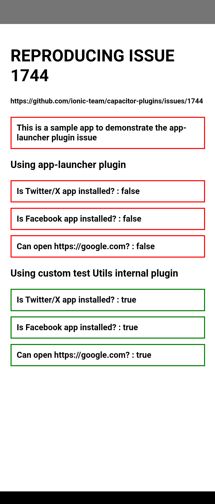

## Sample iOS & Android app to demonstrate an issue with the capacitor/app-launcer plugin on Android

See the issue here : [https://github.com/ionic-team/capacitor-plugins/issues/1744](https://github.com/ionic-team/capacitor-plugins/issues/1744)

-----------------

#### sample app id

`com.kosso.applauncherissue`

- To test this app, please ensure you have both the Twitter/X & Facebook apps installed on iOS and Android test devices. 

This sample app will use the documented `AppLauncher.canOpenUrl()` method to test to see if the Twitter/X and Facebook apps are installed on iOS and Android.  The results are shown in the app window.

To do this, we test for the URLs : `twitter://timeline`  and `fb://feed`.

The test JS code resides in `./js/test-app.js`

### Results (with both Twitter and Facebook apps installed on the devices) from app-laumcher
---------------------
#### Result iOS

---------------------

#### Result Android

---------------------

#### Successful Result on Android using a custom test plugin method

---------------------

